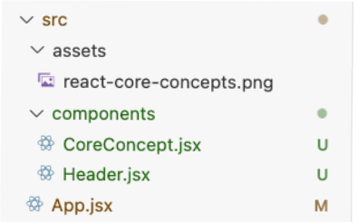

# Academind: React complete guide

Links:
- [Github](https://github.com/academind/react-complete-guide-course-resources/tree/main/attachments/03%20React%20Essentials)
- [Udemy](https://nside.udemy.com/course/react-the-complete-guide-incl-redux/learn/lecture/39648990#overview) 


# Components

They're functions in **U**ppercase that returns a value that can be rendered.

You call a component with this syntax: `<Component />`

```jsx
function Header() {
  return (
    <header>
      ...
    </header>
  );
}

...
function App() {
  return (
    <div>
      <Header />
      ...
    </div>
  );
}
```

## Props

They're properties or parameters you can pass to `Components`. By default, all of them are added in the `prop` object.
 
```jsx
import componentsImg from './assets/components.png';

function CoreConcept(props) {
  return (
    <li>
      
      <h3>{props.title}</h3>
      <p>{props.description}</p>
    </li>
  );

}

...
// usage
function App() {
  return (
    ...
    <section id="core-concepts">
      <h2>Core Concepts</h2>
      <ul>
        <CoreConcept 
          title="Components"
          description="The core UI building block."
          image={componentsImg}            
        />
      </ul>
    </section>
```

You can specify what props you want with **object destructuring**. Then you don't need to use `prop` keyword:

```jsx
function CoreConceptWithObjectDestructuring({ title, description, image }) {
  return (
    <li>
      
      <h3>{title}</h3>
      <p>{description}</p>
    </li>
  );
}

// same usage as before
```

## Component composition: Children props

When you use a `Component` opening and closing tags. The content inside is automatically assigned to the `props.children` property

```jsx
<Component>Content inside</Component>

...
function Component(props) { // props.children value is "Content inside"
  return <div>{props.children}</div>
}

// can also use object destructuring
function Component({children}) {
  return <div>{children}</div>
}
```

# Good structure

Each `Component` in a different file with all their dependencies.



- The URL of the `imports` depends on the location of the component
- The constructor must go with `export default`


```jsx
import reactImg from '../assets/react-core-concepts.png'; // ⬅️ Updated url

// ⬇️ All variables are functions that this Component needs
const reactDescriptions = ...

function getRandomInt(max) {...}
}

export default function Header() { // ⬅️ Now with `export default`
  const description = ...

  return (...);
}
```

## Styles

Each component has it's own style. It's placed next to it with the same name but css extension `Component.css`

Header.css:
```css
header {
  text-align: center;
  margin: 3rem 0;
}

header h1 {
  ...
```

And then in `Header.jsx` we import it
```jsx
import './Header.css';
...
```


# Dynamic content

You can define variables and functions. Then you use it inside curly braces `{}`.

```jsx
import reactImg from './assets/react-core-concepts.png';

const reactDescriptions = ['Fundamental', 'Crucial', 'Core'];

function getRandomInt(max) {
  return Math.floor(Math.random() * max + 1);
}

function Header() {
  const description = "React Essentials";

  return (
    <header>
      
      <h1>{description}</h1>
      <p>
        {reactDescriptions[getRandomInt(2)]} React concepts 
      </p>
    ...
```

# Events

Add **events** to any `Component` using the `onSomething` events. Those events need a function to trigger when the event happens.

```jsx
export default function Component() {
  function handleClick() { ... }
    
  return (
      <button onClick={handleClick}></button>    
  );
}
```

You can make this more dynamic by passing this function as prop argument with custom parameters:
- In `Parent` component:
  - Define the function `myFunction() {...}`
  - Instantiate the `Child` and pass as **prop** the function you defined `() => myFunction()`. Use anonymous function syntax.
- In `Child` component:
  - Expect the function `myFunction` as a **prop**
  - Assign the function to an **event** for any element, like `onClick`.

```jsx
// Parent component: App.jsx
function handleEvent(parameter) { console.log(parameter); }

function App() {
  function printSelection(selectedButton) {
    console.log("Selected button:", selectedButton);
  }

  return (
    ...
    <TabButton handleSelect={() => printSelection("components")}>Components</TabButton>
    <TabButton handleSelect={() => printSelection("jsx")}>JSX</TabButton>
  );
}

// Child component: TabButton.jsx
export default function TabButton({ handleSelect }) {
  return (
    ...
      <button onClick={handleSelect}>Button</button>
    ...
  );
}
```

# Update the UI

> [!CAUTION]
> Never use variables to update the UI! The initial value of the variable is going to be used to render the element. If a function changes the variable value **the UI is not going to be updated!** 

## States
We need to use Hooks. Those hooks:
- Always used in **Components**
- Use them in the top level of the **Component**

### useState hook

How to use `useState`:
1. Import it: `import { useState } from "react";`
2. Declare it in the top level of the **Component**: `const [state, setState] = useState("initialState");`
  - Accepts as argument an initial value: `useState(0)`, `useState('Hello')`
  - returns 2 elements, a variable and a function: 
    - `state`: Variable with current state
    - `setState`: Function to update the `state`
3. Use `setState` function
4. Render again the **Component** ➡️  ✅ This can be used to update the UI!

```jsx
import { useState } from "react"; // 

function App() {
  const [state, setState] = useState("Initial State");

  function appFunction(newState) {
    setSelectedTopic(newState);
  }
  return (
    ...
    <div>state</div>
    ...
    {/* Use `setState` directly in `onClick` event */}
    <button onClick={() => setState("New State")}> Update the state</button>
    {/* Pass `setState` to Component */}
    <Component componentFunction={() => setState("New State")}>
    {/* Pass a function that uses `setState` to Component */}
    <Component appFunction={() => appFunction("New State")}>
```

### Conditional Rendering

You can use states to decide what to render; even if `state` is not defined.

This code will show a default view if `state` is not defined; and then will update the view when `setState` is used.

```jsx
function App() {
  const [state, setState] = useState();

  let content = <p>Default content</p>; 

  // if state is defined, update the content; otherwise keep default
  if (state) content = <p>{state} content</p>

  return (
    ...
    <div>{content}</div>
    ...
  )
}
```